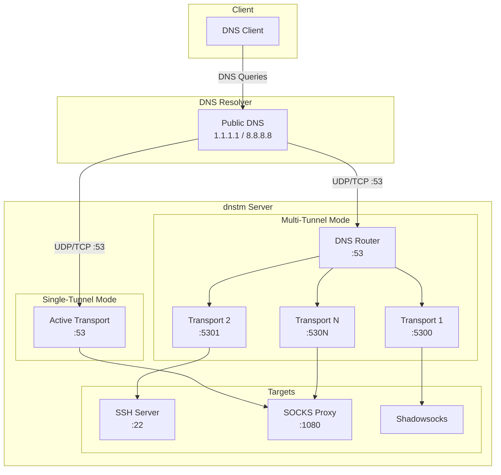

# DNS Tunnel Manager (dnstm)

A tool to deploy and manage DNS tunnel servers on Linux. Supports multiple transport types with flexible operating modes.

## Supported Transports

| Transport                    | Description                                                     |
| ---------------------------- | --------------------------------------------------------------- |
| **Slipstream + Shadowsocks** | Shadowsocks encryption over Slipstream DNS tunnel (recommended) |
| **Slipstream SOCKS/SSH**     | Direct SOCKS proxy or SSH forwarding via Slipstream             |
| **DNSTT SOCKS/SSH**          | SOCKS proxy or SSH forwarding via DNSTT                         |

## Features

- Two operating modes: single-tunnel and multi-tunnel (DNS router)
- Interactive menu and full CLI support
- Auto-generated TLS certificates (Slipstream) and Curve25519 keys (DNSTT)
- Firewall configuration (UFW, firewalld, iptables)
- systemd service management with security hardening
- SSH tunnel user management with sshd hardening
- Integrated microsocks SOCKS5 proxy

## System Overview



## Quick Start

### Install

```bash
curl -sSL https://raw.githubusercontent.com/net2share/dnstm/main/install.sh | sudo bash
```

### DNS Setup

Configure NS records pointing to your server:

```
ns.example.com.  IN  A   YOUR_SERVER_IP
t.example.com.   IN  NS  ns.example.com.
```

### Basic Usage

```bash
# Interactive menu
sudo dnstm

# Install (required first time) - sets up system, selects mode
sudo dnstm install
# CLI: sudo dnstm install --mode single

# Add a tunnel (interactive)
sudo dnstm tunnel add
# CLI: sudo dnstm tunnel add my-tunnel --transport slipstream --backend socks --domain t.example.com

# Start the router
sudo dnstm router start

# Check status
sudo dnstm router status
```

See [CLI Reference](docs/CLI.md) for all available flags and options.

## Operating Modes

### Single-Tunnel Mode (Default)

One tunnel active at a time. The active transport binds directly to port 53.

```bash
sudo dnstm router mode single
sudo dnstm router switch <tag>
```

### Multi-Tunnel Mode

All tunnels run simultaneously. DNS router handles domain-based routing.

> **Note:** Multi-mode overhead is typically minimal. Performance varies by transport and connection method. See [Benchmarks](docs/BENCHMARKS-v0.5.0.md) for details.

```bash
sudo dnstm router mode multi
sudo dnstm router start
```

## Documentation

- [Architecture](docs/ARCHITECTURE.md) - System design and operating modes
- [CLI Reference](docs/CLI.md) - Complete command reference
- [Configuration](docs/CONFIGURATION.md) - Configuration files and options
- [Client Setup](docs/CLIENT.md) - Client-side connection guides
- [Development](docs/DEVELOPMENT.md) - Action-based architecture and adding commands

## Requirements

- Linux (Debian/Ubuntu, RHEL/CentOS/Fedora)
- Root access
- systemd
- Domain with NS records pointing to your server

## Building from Source

```bash
git clone https://github.com/net2share/dnstm.git
cd dnstm
go build -o dnstm .
```
