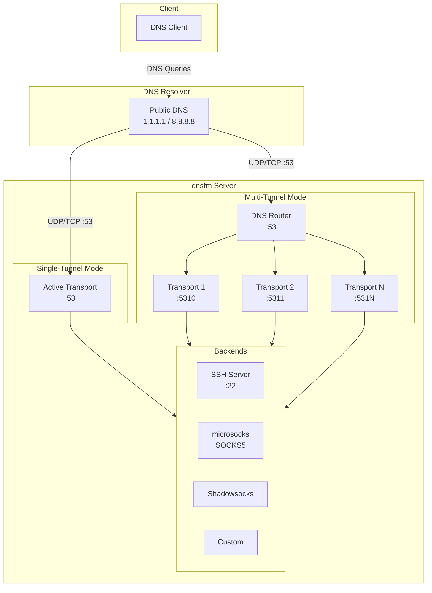

# DNS Tunnel Manager (dnstm)

A CLI tool to deploy and manage DNS tunnel servers on Linux. Run single tunnels or scale with the built-in DNS router for multi-tunnel setups. Configure via interactive menu, CLI commands, or config files with auto-generated certificates and keys.

## Supported Transports

| Transport      | Description                                    |
| -------------- | ---------------------------------------------- |
| **Slipstream** | High-performance DNS tunnel with TLS encryption |
| **DNSTT**      | Classic DNS tunnel using Curve25519 keys       |

## Supported Backends

| Backend         | Description                              | Transports       |
| --------------- | ---------------------------------------- | ---------------- |
| **SOCKS**       | Built-in microsocks SOCKS5 proxy         | Slipstream, DNSTT |
| **SSH**         | Forward to local SSH server              | Slipstream, DNSTT |
| **Shadowsocks** | Encrypted proxy via SIP003 plugin        | Slipstream only  |
| **Custom**      | Forward to any TCP address               | Slipstream, DNSTT |

## Features

- Two operating modes: single-tunnel and multi-tunnel (DNS router)
- Interactive menu and full CLI support
- Auto-generated TLS certificates (Slipstream) and Curve25519 keys (DNSTT)
- Firewall configuration (UFW, firewalld, iptables)
- systemd service management with security hardening
- SSH tunnel user management with sshd hardening
- Integrated microsocks SOCKS5 proxy

## System Overview



## Quick Start

### DNS Setup

Configure NS records pointing to your server:

```
ns.example.com.  IN  A   YOUR_SERVER_IP
t.example.com.   IN  NS  ns.example.com.
```

### Concepts

- **Backend**: Where traffic goes after decapsulation (socks, ssh, shadowsocks, custom)
- **Transport**: DNS tunnel protocol (slipstream or dnstt)
- **Tunnel**: A transport + backend + domain combination

> **Note:** Slipstream + Shadowsocks uses SIP003 plugin mode - the shadowsocks server runs as a plugin to slipstream, providing encrypted tunneling. This requires defining a shadowsocks backend instead of using the built-in socks proxy.

### Install

```bash
curl -sSL https://raw.githubusercontent.com/net2share/dnstm/main/install.sh | sudo bash
```

### Configuration Methods

#### 1. Interactive Menu

```bash
sudo dnstm
# Navigate: Tunnels → Add
```

#### 2. CLI Commands

```bash
# Add slipstream + socks tunnel
sudo dnstm tunnel add -t slip-socks --transport slipstream --backend socks --domain t1.example.com

# Add dnstt + ssh tunnel
sudo dnstm tunnel add -t dnstt-ssh --transport dnstt --backend ssh --domain t2.example.com

# Add slipstream + shadowsocks tunnel (creates shadowsocks backend automatically)
sudo dnstm backend add -t my-ss --type shadowsocks --password mypass123 --method aes-256-gcm
sudo dnstm tunnel add -t slip-ss --transport slipstream --backend my-ss --domain t3.example.com

# Add slipstream + custom backend (e.g., MTProto proxy)
sudo dnstm backend add -t mtproto --type custom --address 127.0.0.1:8443
sudo dnstm tunnel add -t slip-mtproto --transport slipstream --backend mtproto --domain t4.example.com

# Start router
sudo dnstm router start
```

#### 3. Config File

```bash
sudo dnstm config load config.json
```

Example `config.json` (certs/keys auto-generated):
```json
{
  "backends": [
    {
      "tag": "my-ss",
      "type": "shadowsocks",
      "shadowsocks": { "password": "mypass123", "method": "aes-256-gcm" }
    },
    {
      "tag": "mtproto",
      "type": "custom",
      "address": "127.0.0.1:8443"
    }
  ],
  "tunnels": [
    {
      "tag": "slip-socks",
      "transport": "slipstream",
      "backend": "socks",
      "domain": "t1.example.com",
      "port": 5310
    },
    {
      "tag": "dnstt-ssh",
      "transport": "dnstt",
      "backend": "ssh",
      "domain": "t2.example.com",
      "port": 5311
    },
    {
      "tag": "slip-ss",
      "transport": "slipstream",
      "backend": "my-ss",
      "domain": "t3.example.com",
      "port": 5312
    },
    {
      "tag": "slip-mtproto",
      "transport": "slipstream",
      "backend": "mtproto",
      "domain": "t4.example.com",
      "port": 5313
    }
  ],
  "route": { "mode": "multi" }
}
```

### Common Commands

```bash
sudo dnstm router status          # View router and tunnel status
sudo dnstm tunnel list            # List all tunnels
sudo dnstm tunnel logs -t <tag>   # View tunnel logs
sudo dnstm router logs            # View router logs (multi-mode)
sudo dnstm update                 # Check for and install updates
sudo dnstm uninstall              # Remove all components
```

See [CLI Reference](docs/CLI.md) for all available flags and options.

## Operating Modes

### Single-Tunnel Mode (Default)

One tunnel active at a time. The active transport binds directly to port 53.

```bash
sudo dnstm router mode single
sudo dnstm router switch -t <tag>
```

### Multi-Tunnel Mode

All tunnels run simultaneously. DNS router handles domain-based routing.

> **Note:** Multi-mode overhead is typically minimal. Performance varies by transport and connection method. See [Benchmarks](docs/BENCHMARKS-v0.5.0.md) for details.

```bash
sudo dnstm router mode multi
sudo dnstm router start
```

## Documentation

- [Architecture](docs/ARCHITECTURE.md) - System design and operating modes
- [CLI Reference](docs/CLI.md) - Complete command reference
- [Configuration](docs/CONFIGURATION.md) - Configuration files and options
- [Client Setup](docs/CLIENT.md) - Client-side connection guides
- [Development](docs/DEVELOPMENT.md) - Action-based architecture and adding commands

## Requirements

- Linux (Debian/Ubuntu, RHEL/CentOS/Fedora)
- Root access
- systemd
- Domain with NS records pointing to your server

## Building from Source

```bash
git clone https://github.com/net2share/dnstm.git
cd dnstm
go build -o dnstm .
```
